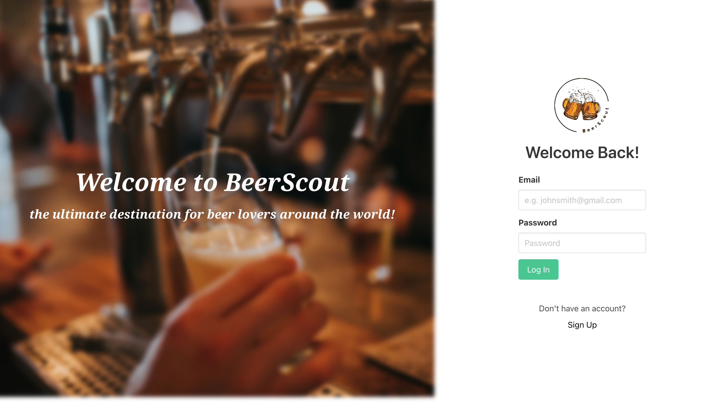
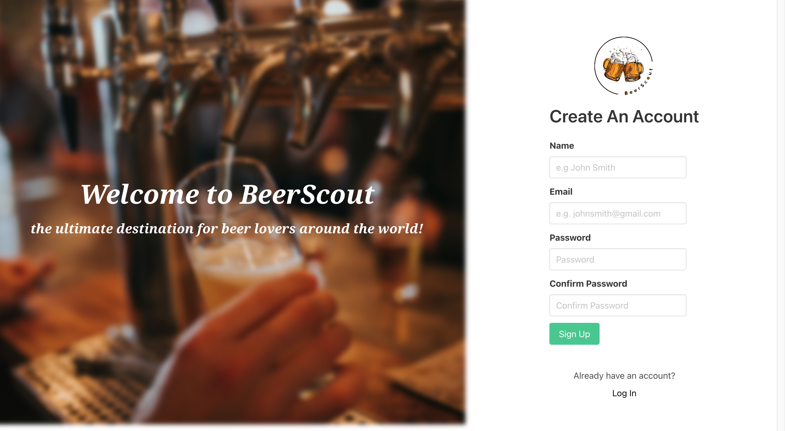
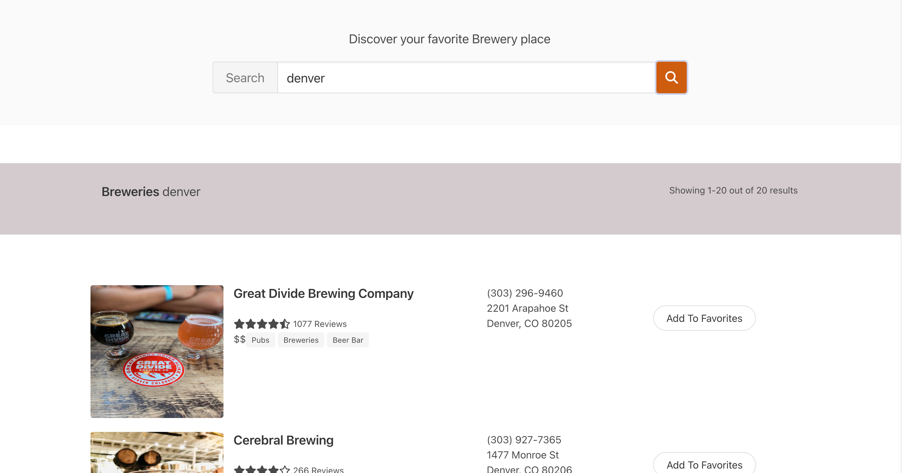

# BeerScout

## Overview: 

---

At BeerScout, we embrace the idea that beer is more than a drink—it's a way of life that unites people and creates lasting memories.

Our platform helps you discover top-notch breweries worldwide, tailored to your location, ensuring a perfect fit for any occasion. 

We celebrate establishments that foster a welcoming atmosphere and cherish those that accommodate our furry friends. Embark on your beer exploration journey with BeerScout today and experience unforgettable moments. Cheers!

---

## Screenshot(s):

---
## Technologies Used:

* [Yelp Fusion API](https://www.yelp.com/developers/documentation/v3/get_started)
* [Node.js](https://nodejs.org/)
* [Express](https://expressjs.com/)
* [MongoDB](https://www.mongodb.com/)
* [Mongoose](https://mongoosejs.com/)
* [React](https://reactjs.org/)
* [Bulma](https://bulma.io/)
* [CSS3](https://www.w3.org/Style/CSS/Overview.en.html)

---
## Getting Started:

https://beer-scout.herokuapp.com/

---

### Icebox:

---
### References:
* React-rating: https://github.com/dreyescat/react-rating
* Icons: https://fontawesome.com/
