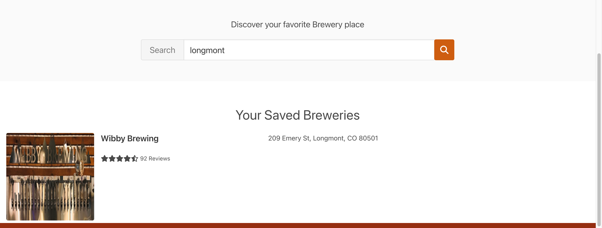
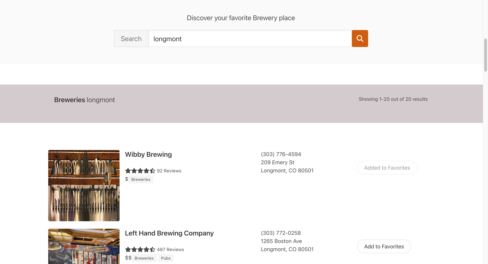

# BeerScout

## Overview: 

---

At BeerScout, we believe that discovering great breweries is an adventure that should be enjoyed by everyone. 

Our platform helps you find the best breweries tailored to your location, ensuring that you have a memorable experience every time.

You can save your favorite breweries and easily access them in the future. We celebrate establishments that foster a welcoming atmosphere and accommodate our furry friends, making BeerScout the perfect tool for planning your next beer excursion.

---

## Features: 

* Search for breweries using your location
* View detailed information about each brewery, including its address, hours, and ratings
* Save your favorite breweries and easily access them in the future

---

## Screenshot(s):

---
## Technologies Used:

* [Yelp Fusion API](https://www.yelp.com/developers/documentation/v3/get_started)
* [Node.js](https://nodejs.org/)
* [Express](https://expressjs.com/)
* [MongoDB](https://www.mongodb.com/)
* [Mongoose](https://mongoosejs.com/)
* [React](https://reactjs.org/)
* [Bulma](https://bulma.io/)
* [CSS3](https://developer.mozilla.org/en-US/docs/Web/CSS)

---
## Getting Started:

https://beer-scout.herokuapp.com/

---

### Icebox:

* Add a Map API
* Remove brewery from favorites functionality
* Users can read the reviews and add their own

---
### References:
* React-rating: https://github.com/dreyescat/react-rating
* Icons: https://fontawesome.com/
